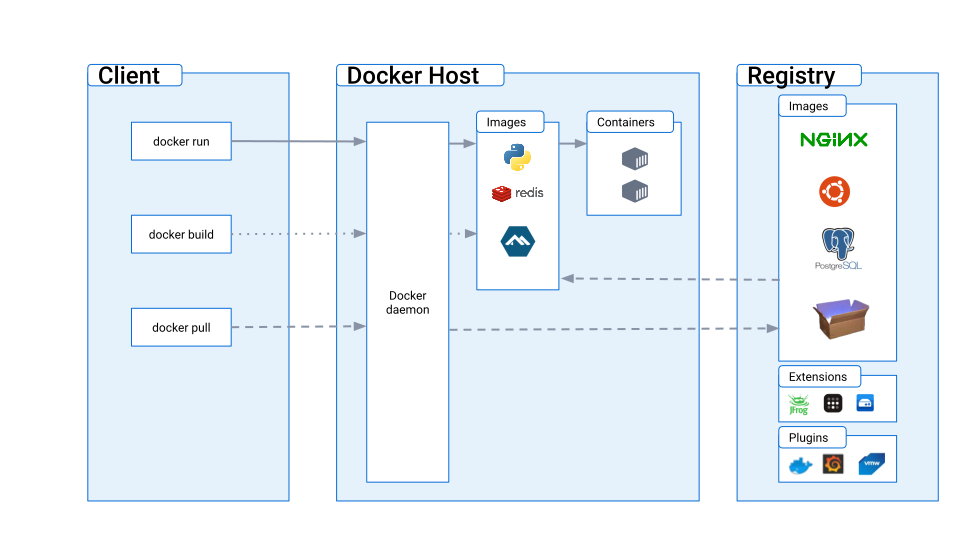

# A.2. Arsitektur Docker

Arsitektur Docker terdiri dari tiga komponen utama yaitu: Docker client, Docker host, dan Docker Registry.

## A.2.1. Docker Client
Docker Client adalah sebuah CLI (Command Line Interface) yang digunakan untuk berinteraksi dengan Docker daemon. Docker Client dapat diinstal di berbagai sistem operasi seperti Windows, macOS, atau Linux. Dengan menggunakan Docker Client, Developer dapat membuat, menjalankan, dan mengatur container Docker.

## A.2.2. Docker Host
Docker Host adalah sebuah server yang menjalankan Docker daemon. Docker Host bertanggung jawab untuk mengelola semua container Docker dan menyediakan layanan untuk build, run, dan stop container. Docker Host juga dapat diinstal di berbagai sistem operasi seperti Windows, macOS, atau Linux.

## A.2.3. Docker Registry
Docker Registry adalah sebuah tempat penyimpanan yang digunakan untuk menyimpan image Docker. Image Docker dapat dibuat oleh pengguna dan diunggah ke Docker Registry, sehingga pengguna lain dapat mengunduh dan menggunakan image tersebut.

Secara keseluruhan, arsitektur Docker memungkinkan Developer untuk membuat dan menjalankan aplikasi dalam container yang terisolasi dari sistem operasi host. Hal ini memungkinkan Developer untuk menjalankan aplikasi dengan lebih efisien dan memastikan bahwa aplikasi dapat dijalankan di berbagai enviroment.